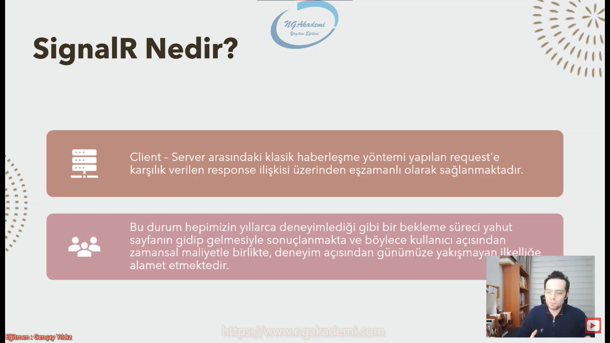
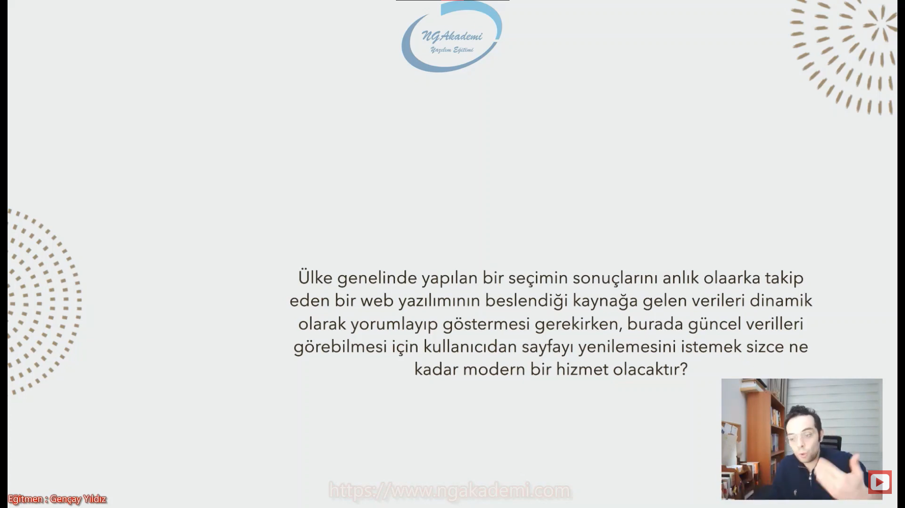
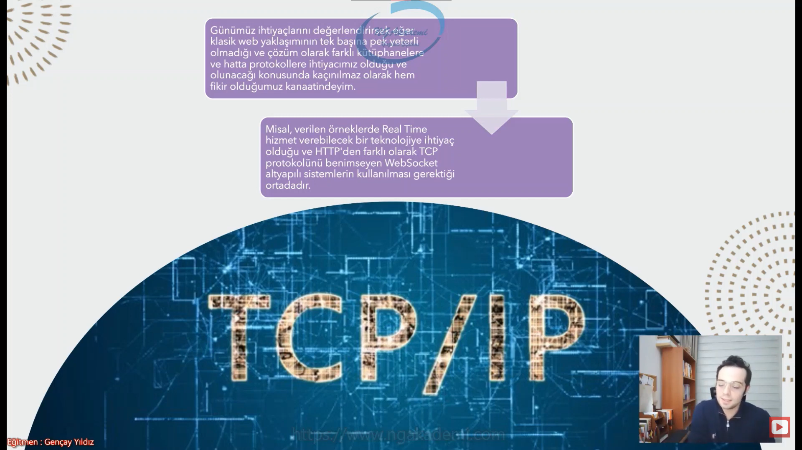
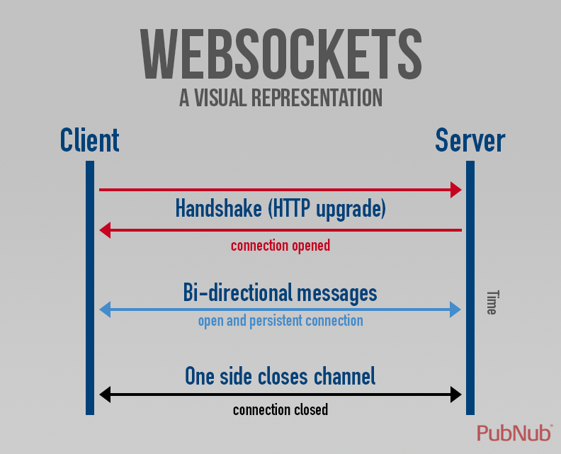
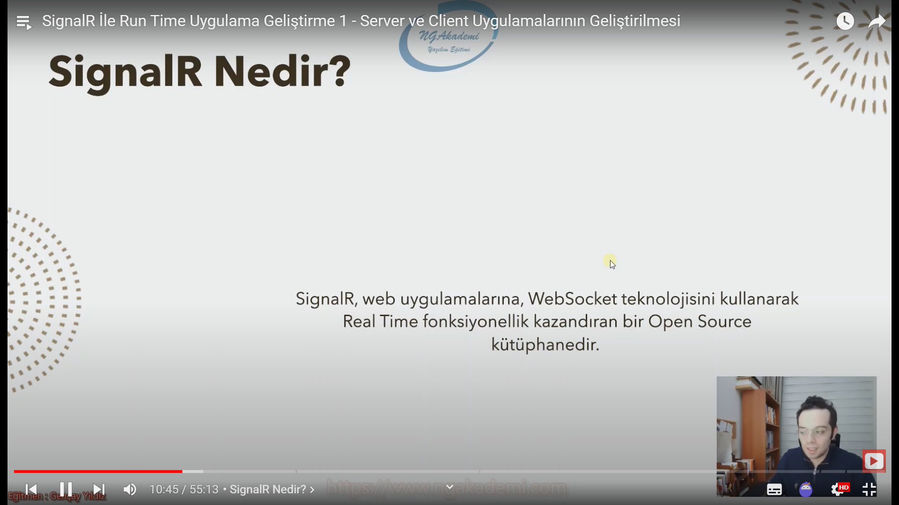
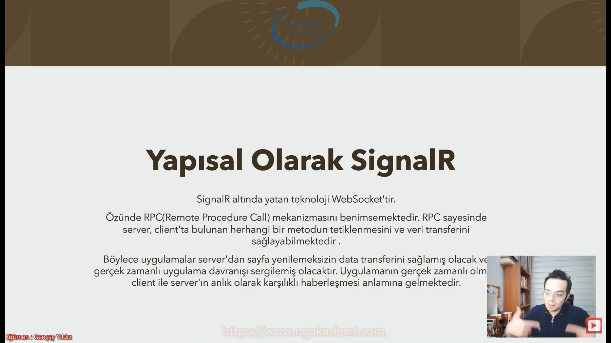
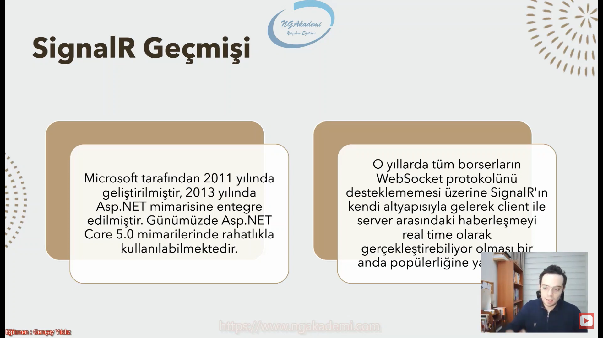
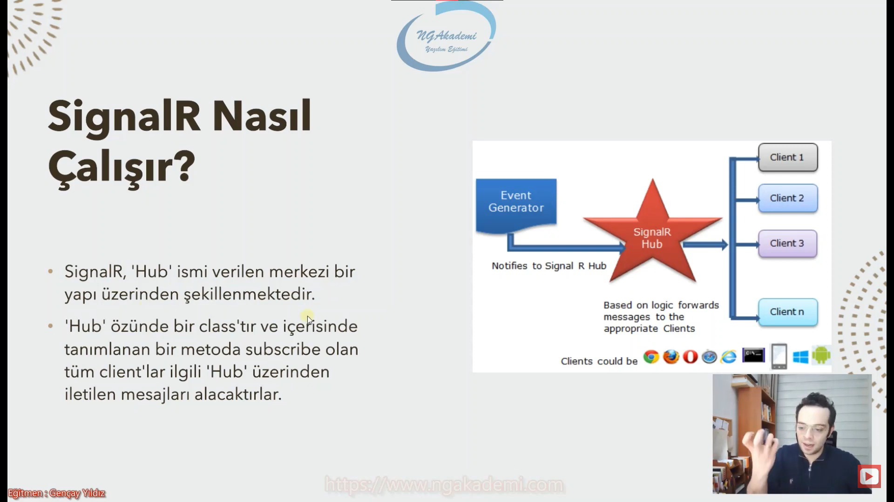

# SignalR

***
# [Bu notları Gençay Yıldız hocamın sayesinde izlediğim bu playlistten öğrendim.](https://www.youtube.com/playlist?list=PLQVXoXFVVtp3RSycdru4WpnfPEOFxONiX)  Herkesin izlemesini tavsiye ederim. Mükemmel bir anlatım. Böyle mükemmel bir içerikli [Türkçe kaynağı](https://www.youtube.com/c/Gen%C3%A7ayY%C4%B1ld%C4%B1z) hiçbir yerde bulamazsınız.
***

# SignalR Nedir?
- Client - Server arasındaki ilişki klasik haberleşme yöntemi yapılan request'e karşılık verilen response ilişkisi üzerinden eşzamanlı olarak sağlanmaktadır.

- Bu durum hepimizin yıllarca deneyimlediği gibi bir bekleme süreci yahut sayfanın gidip gelmesiyle sonuçlanmakta ve böylece kullanıcı açısından zamansal maliyetle birlikte deneyim açısından günümüze yakışmayan ilkelliğe alamet etmektedir.

- Client server'a bir request gönderir. Server gelen bu request neticesinde gerekli sonucu üretir gerekli datalarla işlemleri yapar ve üretilen sonucu response olarak geri client'a döndürür.

 

- Ülke genelinde yapılan bir seçimin sonuçlarını anlık olarak takip eden bir web yazılımının beslendiği kaynağa gelen verileri dinamik olarak yorumlşayıp göstermesi gerekirken, burada güncel verileri görebilmesi için kullanıcıdan sayfayı yenilemesini istemek sizce ne kadar modern bir hizmet olacaktır.

 

- Ya da günümüzün imtihanı Covid-19(nam-ı değer Korona Virüs) verilerini yayınladığımız güncel bir web uygulamasının anlık olarak girilen verilerinin grafiksel olarak anında yansıtıldığını tahayyül ederseniz, klasik web yaklaşımının(request/response) bu süreçte ne kadar efektif bir rol üstlendiğini söyleyebilirsiniz... 

 

- Günümüz ihtiyaçlarını değerlendirirsek eğer klasik web yaklaşımının tek başına pek yeterli olmadığı ve çözüm olarak farklı kütüphanelere ve hatta protokollere ihtiyacımız olduğu ve olunacağı konusunda kaçınılmaz olarak hem fikir olduğumuz kanaatindeyim.

- Misal verilen örneklerde Real Rime hizmet verebilecek bir teknolojiye ihtiyaç olduğu ve HTTP'den farklı olacak TCP protokolünü benimseyen WebSocket alyapılı sistemlerin kullanılması gerektiği ortadadır.

 

# WebSocket Nedir?
- TCP bağlantısı Client - Server arasıdna çift yönlü mesajlaşmayı sağlayan bir protokoldür.

- HTTP üzerinden yapmış olduğunuz çalışmalarda Client Server'ı tetikleyebiliyor ama Server Client'ı tetikleyemiyor. Yani ilgili bir fonksiyonunu çalıştıramaz client'ta.

- WebSocket kullanıyorsanız eğer TCP üzerinden Client Server'daki herhangi bir fonksiyonu tetikleyebilirken benzer mantıkla Server'da Client'taki herhangi bir fonksiyonu tetikleyebilmektedir.

- Bir istekte bulunulduğu zaman cevap beklenilmemektedir. Tabi isteğe ya da ihtiyaca göre cevapta dönülebilir.

- Client server’a, server client’a veri gönderebilir. Çift yönlü mesajlaşma.

- Server, gelen verileri abonelere iletir.

- İki taraf gönderdiği mesajlara cevap beklememektedir.


 

- Yukarıdaki şemadan HTTP/REST Request işlevselliğini incelerseniz eğer her bir requeste karşılık bir response olduğunu göreceksiniz. HTTP protokolünde requeste karşılık dönülecek bir data olsun olmasın bir response dönülmesi mecburidir.

 

- Websocket şemasını incelerseniz eğer açık bir TCP bağlantısı üzerinden tüm süreç işlemektedir. Handshake(el sıkışma/tokalaşma) işleminin ardından Acknowledgement(onay/tasdik) yapıldıktan sonra Bi-directional message(çift yönlü mesajlaşma) süreci başlamaktadır. Taa ki connection end olana kadar.

 

# SignalR Nedir?
- SignalR web uygulamalarına WebSocket teknolojisini kullanarak Real Time fonksiyonellik kazandıran bir Open Source kütüphanedir.

 

# Yapısal Olarak SignalR
- SignalR altında yatan teknoloji WebSocket'tir.

- Özünde RPC(Remote Procedure Call) mekanizmasını benimsemektedir. RPC sayesinde server, client'da bulunan herahngi bir metodun tetiklenmesini ve veri transferini sağlayabilmektedir.

- RPC => Uzaktan bir yordamı/prosedürü çağırma mekanizmasıdır.Buradaki mekanizma bize Uzaktaki herhangi fonksiyonu çağırmayı sağlıyor.

- Böylece uygulamalar server'dan sayfa yenilemeksizin data transferini sağlamış olacak ve gerçek zamanlı uygulama davranışı sergilemiş olacaktır. Uygulamanın gerçek zamalı olması client ile server'ın anlık olarak karşılıklı haberleşmesi anlamına gelmektedir.

 

- Microsoft ttarafından 2011 yılında geliştirilmiştir. 2013 yılında Asp.NET mimarisine entegre edilmiştir. Günümüzde Asp.NET Core 5.0 mimarilerindew rahatlıkla kullanılabilmektedir. 

- O Yıllarda tüm browserların WebSocket protokolünü desteklememesi üzerine SignalR'ın kendi altyapısıyla gelerek client ile server arasındaki haberleşmeyi real time olarak gerçekleştirebiliyor olması bir anda popülerliğine yaramıştır.

 

# SignalR Nasıl Çalışır?
- SignalR 'Hub' ismi verilen merkezi bir yapı üzerinden şekillenmektedir.

- 'Hub' özünde bir class'tır ve içerisinde tanımlanan bir metoda subscribe olan tüm client'lar ilgili 'Hub' üzerinden iletilen mesajları alacaktırlar.

 

- Nihayetide sayfanın git gel olmaksızın Request Response'a girmeksizin dinamik bir şekilde Server'la haberleşmek ve Server'dan herhangi bir datayı client'ta bir metodu tetikleyerek elde edebilmek için kullandığımız teknoloji.


```C#
İlk olarak tüm clientların istek yapacağı bir sınıf oluşturulur. Sonrasında ise bu sınıf için bir endpoint verilir.
public class MyHub : Hub
{
    public async Task SendMessageAsync(string message)
    {
        await Clients.All.SendAsync("receiveMessage",message);
    }
}
app.UseEndpoints(endpoints =>
{
    endpoints.MapHub<MyHub>("/myhub");
});
```
```HTML
İlk olarak istek yapılacak adres belirtilir yukarıdaki belirttiğimiz endpoint'i adres olarak withUrl fonksiyonuna sağlarız. Yani burada connection string'i oluşturup sağladık diyebiliriz.
 <script>
      $(document).ready(() => {
        const connection = new signalR.HubConnectionBuilder()
          .withUrl("https://localhost:5001/myhub")
          .build();

        connection.start();

        $("#btnGonder").click(() => {
          let message = $("#txtMessage").val();
          connection
            .invoke("SendMessageAsync", message)
            .catch((error) =>
              console.log(`Mesaj Gönderilirken Hata Oluştuç ${error}`)
            );
        });
        //Bu metotla RPC sistemiyle server tarafından hangi metot tetikleniyorsa on fonksiyonuya bu metodu buradan tanımlayabiliyoruz.
        connection.on("receiveMessage", message => {
          $("div").append(message + "<br>");
        });
      });
    </script>
```


# ! Elindeki silahı tanıyacaksın ki ona göre operasyona/cepheye gideceksin


# Otomatik Bağlantı Konfigürasyonu | Durum Fonksiyonları
- SignalR teknolojisinin kullanıldığı bir uygulamada siz client'ı açtınız ayağa kaldırdınız Eğer ki server bağlantı yapabileceğimiz Connection'ı kullanabileceğimiz server açık değilse ya da bir hata verdiyse herahngi bir patlama meydan geldiyse yani bir bağlantının meydana getirelemediği durum söz konusuysa veya bağlantıyı kurdunuz süreçte bir problem meydana geldi böyle bi durumda ise süreçte bağlantının kopma durumu söz konusuysa bu tarz durumlarda nasıl aksiyonlar alabileceğimizi sağlayan fonksiyonlardır.

- SignalR vasıtasıyla client ile server arasında eş zamanlı bir etkileşim sağlanmaya çalışılırken ilk etapta bir bağlantıın olmaması durumu ya da var olan bağlantı süreç içerisinde kopabiliyorsa böyle durumlara istinaden bu bağlantının yeniden kurulması ya ilk olarak belirli aralıklarla sağlanmaya çalışılmalı yeniden kurulum ya da ilk etapta kurulum olmadıysa tekrar tekrar bu kurulumun yapılması için taleplerin gönderilmesi.


# withAutomaticReconnect Fonksiyonuyla Kopan Bağlantıyı Yeniden Denemek
``` Javascript
const connection = new signalR.HubConnectionBuilder()
        .withUrl("https://localhost:5001/myhub")
        .withAutomaticReconnect()// Defaultta bu şekilde çalışır => 0 - 2 - 10 - 30
        .build();
```

- Toplam 4 periyotta bağlantı talebinde bulunur.Periyotlar 0. saniye de, 2. saniye de 10. saniye de ve 30. saniye de.

- Parametre olarak sayı dizisi yollarız ve bu şekilde kaç saniye aralıklarla bu işlemi gerçekleştireceğini bildirebiliriz.

- Bağlantı var lakin koptuğu durumlarda kullanılır. 

``` Javascript
const connection = new signalR.HubConnectionBuilder()
        .withUrl("https://localhost:5001/myhub")
        .withAutomaticReconnect([1000,1000,2000,3000,10000])
        .build();
```

# Hiç Kurulmayan Bağlantıyı Sağlamaya Çalışmak
- Burada recursive bir fonksiyon yazıyoruz.

``` Javascript
//Bağlantı hiç kurulmadığı durumlarda bu fonksiyon kullanılır.
async function start() {
    try {
    await connection.start();
    } catch (error) {
    setTimeout(() => start(), 2000);
    }
}
```

# Durum Fonksiyonları
- Durum fonksiyonları withAutomaticReconnect konfigürasyona göre sonuç verir.
## onreconnecting => Yeniden bağlanma girişimlerini başlatmadan önce fırlatılan/tetiklenen eventtir.
- Kullanıcının var olan bağlantısı diyelim ki süreçte koptu. Kopan bu bağlantıyı yeniden sağlayabilmek için yapılacak olan telepten önce bu event fırlatılır. Haliyle biz öncelikle yapılması gereken işlemler varsa temizlenmesi gereken cookie'ler falan bişeyler varsa ya da kullanıcıyı bilgilendirmemiz gerekiyorsa yeniden talep yapmadan önce onreconnecting fonksiyonunda çalışırız.

## onreconnected => Yeniden bağlantı gerçekleştiğinde fırlatılan/tetiklenen eventtir.
- Şimdi kullanıcının bağlantısı koptu onreconnecting ile kullanıcıya yeniden bağlanacağız gibisinden bir uyarıda bulunuyorsun eğer ki bu talebi yaptın Talep neticesinde yeniden bağlantı sağlandıysa onreconnected eventi fırlatılacak dolayısıyla kullanıcıya da burada yeniden bağlantı sağlanmıştır gibisinden bir mesaj verebileceksiniz.

## onreclose=> Yeniden bağlantı girişimlerinin sonuçsuz kaldığı durumlarda fırlatılan/tetiklenen eventtir.


- Her bir client server'a bağlandığında otomatik bir connection id atanıyor. Yani client'lar sunucuya bağlandığı zaman ilgili hub'a bağlandığında client'ların birbirinden ayrılabilmesi için bunlara id atanmakta.

```Javascript
connection.onreconnecting(error => {
    durum.css("background-color", "blue");
    durum.css("color", "white");
    durum.html("Bağlantı Kuruluyor...");
    durum.fadeIn(2000, () => {
    setTimeout(() => {
        durum.fadeOut(2000);
    }, 2000);
    });
});
connection.onreconnected(connectionId => {
    durum.css("background-color", "green");
    durum.css("color", "white");
    durum.html("Bağlantı Kuruldu...");
    durum.fadeIn(2000, () => {
    setTimeout(() => {
        durum.fadeOut(2000);
    }, 2000);
    });
});
connection.onclose(connectionId => {
    durum.css("background-color", "red");
    durum.css("color", "white");
    durum.html("Bağlanılamadı...");
    durum.fadeIn(2000, () => {
    setTimeout(() => {
        durum.fadeOut(2000);
    }, 2000);
    });
});
```

# Client Bağlantılarını Yönetmek Ve İzleyebilmek
- SignalR'da temel merkezi yapılanmamız Hub dediğimiz yapılanmadır. 

- Hubları kullanmak için Client'larımız bu Hub'lara subscribe oluyor. 

- Hub'a gelen herhangi bir mesaj bütün client'lara otomatik gönderilebiliyor.

  * Sisteme yeni bir client dahil olduğunda diğer clientları bu client'tan nasıl haberdar edebileceğiz?

  * Herhangi bir client(dahil olan olmayan farketmiyor) diğer client'lardan nasıl haberdar olabiliyor ya da sistemde herhangi bir client bağlantıyı kopardığı zaman bunu tekrardan diğer client'lara nasıl haberdar edebiliyoruz?

- İşte böyle ihtiyaçlara istinaden bağlantı olaylarını kullanmamız gerekecektir.
 
- Bağlantı olayları SignalR kütüphanesinde server kanadında kullandığımız bir fonksiyonel yapılanmadır.

- Sisteme herhangi bir client bağlantı sağladığında sistem tarafından bir event/olay gerçekleştirilir. Bu olay ile sen diğer client'lara haber verebiliyorsun.

- Sistemde herhangi bir kullanıcı bağlantıyı kopardı yani çıktı herhangi bir client'ı kapattı ya da bir kesintiye uğradı böyle bir durumda da başka bir event tetikleniyor bu event sayesinde de diğer client'ları tekrardan uyarabiliyoruz. 

- Yani anlayacağınız sisteme uygulamaya client'lar tarafından bağlantı söz konusu olduğunda belirli fonksiyonlar devreye giriyor biz bunlara eventler diyeceğiz. Bu eventler aracılığıyla biz sistemi belirli amaçlar doğrultusunda çalıştırabiliyoruz. Genellikle client'ları uyarabiliyoruz ya da gerekirse loglama mekanizmalarını devreye sokabiliyoruz.

- Sisteme bir client dahil olduğunda yani bir bağlantı kurulduğunda tetiklenen olay OnConnectedAsync fonksiyonudur.

- Hub'tan var olan bağlantısını koparan client söz konusu olursa OnDisconnectedAsync fonksiyonu tetiklenir.

- Bu olaylar/fonksiyonlar sayesinde canlı bir şekilde kimlerin dahil olduğunu, kimlerin sistemden çıktığını, hangi kullancının mevcut olduğunu vs. çok rahat bir şekilde öğrenebilmekteyiz.


- Bağlantı olayları signalR uygulamalarında loglama için oldukça elverişli fonksiyonlardır.

# OnConnectedAsync ve OnDisconnectedAsync Fonksiyonlarının Override Edilmesi

- Sisteme herhangi bir client bağlantı sağladığı zaman o client'ın sayfasını eğer ki html bazlı bir client'sa sayfayı yenilemek demek önce bağlantıyı koparmak daha sonra yenilemek demektir.

```C#
public override Task OnConnectedAsync()
{
  return base.OnConnectedAsync();
}

public override Task OnDisconnectedAsync(Exception exception)
{
  return base.OnDisconnectedAsync(exception);
}
```

# ConnectionId Nedir?
- Operasyonlarımızda client'ları birbirlerinden ayırabilmemiz için kullanabileceğimiz değerdir.

- ConnectionId sistemdeki var olan birden fazla olabilecek client'ları birbirlerinden ayırabilmemizi sağlayan bir numaradır/id'dir. Sistem tarafından otomatik üretilip client'lara verilmektedir. 

- Hub'a bağlantı gerçekleştiren client'lara sistem tarafından verilen unique/tekil bir değerdir. 

- Amacı clientları birbirlerinden ayırmaktır.

- Client'ları birbirinden ayırdığımızda hedef client ya da client'lara belirli amaçlar doğrultusunda mesajlar/işlemler gerçekleştirebiliyoruz.

- Yani elinizdeki client havuzunda Hub'a bağlı olan birden fazla client'ın arasından belirli seçtiklerinize değer göndermek/mesaj göndermek onlarla iletişim kurmak istiyorsanız ConnectionId'yi kullanabilirsiniz.

```C#
public async override Task OnConnectedAsync()
{
    await Clients.All.SendAsync("userJoined", Context.ConnectionId);
}

public override async Task OnDisconnectedAsync(Exception exception)
{
    await Clients.All.SendAsync("userLeaved", Context.ConnectionId);
}
```

```HTML
connection.on("userJoined", (connectionId) => {
  durum.html(`${connectionId} bağlandı.`);
  durum.css("background-color", "green");
  animation();
});

connection.on("userLeaved", (connectionId) => {
  durum.html(`${connectionId} ayrıldı.`);
  durum.css("background-color", "red");
  animation();
});
```

# Bağlı Olan Tüm Client'ları Listelemek
```C#
public class MyHub : Hub
{
    static List<string> clients = new List<string>();
    public async Task SendMessageAsync(string message)
    {
        await Clients.All.SendAsync("receiveMessage", message);
    }

    public async override Task OnConnectedAsync()
    {
        clients.Add(Context.ConnectionId); 
        await Clients.All.SendAsync("clients",clients);
        await Clients.All.SendAsync("userJoined", Context.ConnectionId);
    }

    public override async Task OnDisconnectedAsync(Exception exception)
    {
        clients.Remove(Context.ConnectionId);
        await Clients.All.SendAsync("userLeaved", Context.ConnectionId);
        await Clients.All.SendAsync("clients", clients);  
    }
}
```
```HTML
connection.on("clients", (clientsData) => {
  let text = "";
  $.each(clientsData, (index, item) => {
    text += `<li>${item}</li>`;
  });
    $("#clients").html(text);
});
```

# IHubContext Arayüzü 
- Server'le Client arasındaki ilişkiyi Hub üzerinden sağlarız.

- Çalıştığımzı projelerde SignalR üzerinden WebSocket'ı kullanıyorsak ihtiyaca binaen Business yani iş mantığında bazen Socket işlemlerine ihityacını olabilir. Dolayısıyla böyle bir durumda Hub sınıflarını siz iş mantıklarında kullanamazsınız.

- Hub sınıfları instance'ını üreteyim iş mantıklarında bunun üzerinden belirli operasyonlar gerçekleştireyim diyebileceğiniz sınıflar değildir.

- Server'a bağlı client'lara ileti göndermeye yönelik çalışmaları Hub sınıflarından soyutlamamızı sağlayan ve böylece ileti gönderimini Hub dışı kontrol haline getirmemizi sağlayan interface'tir. IHubContext interface'i.

- IHubContext interface'i sayesinde Hub'taki sorumlulukları/çalışmaları/WebSocket operasyonlarını normal sınıflara taşıyabilmekte ve oralarda operasyonlar gerçekleştirebilmekteyiz.
  *  İş mantıklarında WebSocket işlemlerini gerçekleştirebiliriz.

  * Controller'larda gelen Request'in neticesinde RealTime bir şekilde WebSocket üzerinden siz client'lara çalışmalar yapmanız gerekebilir. Bunları controller'da direkt tetikleyebileceğiniz bir özellik sizlere tanıyacaktır.

  * Ve daha da önemlisi günümüzde özellikle web uygulamalarında neredeyse olmazsa olmaz diyeceğimiz belirli Design Pattern'lar var. Kurumsal yaklaşımalr var. Örneğin Dependency Injection Design Pattern'ı bunun gibi yapılanma üzerinden de siz Hub sınıflarınız daha doğrusu WebSocket operasyonlarınızı kullanabiliyor olacaksınız.

- Normal sınıflarda WebSocket işlemlerini gerçekleştirmek için kullandığımız interface'tir.

```C#
public class MyBusiness
{
    private readonly IHubContext<MyHub> _hubContext;

    public MyBusiness(IHubContext<MyHub> hubContext)
    {
        _hubContext = hubContext;
    }

    public async Task SendMessageAsync(string message)
    {
        //Ekstra işlemler....
        await _hubContext.Clients.All.SendAsync("receiveMessage", message);
    }
}
```

# Strongly Typed Hubs Özelliği
- SignalR uygulamalarında ve bunun gibi birden fazla sistemin bir arada iletişim kurduğu uygulmalarda kullanılan önemli bir özelliktir.

- Bu özellik Yazılım uygulamalarında sistemler arası haberleşmeleri yahut ortak tanımlamaları metinsel/statik değerler üzerinden sağlamaya çalışmak, olası hata yapma ihtimallerini arttırmakta ve böylece sürece ister istemez ekstra bir zorluk kazandırmaktadır.

- Hub sınıflarımızda ya da Hub'ı modellediğimiz business sınıfımızda Server'dan Client'taki herhangi bir fonksiyonu tetikleyebilmeniz için Client'daki fonksiyonlara karşılık gelen buradaki metotların isimlerini metinsel olarak girmeniz gerkiyor işte böyle bir durumda SignalR mimarisinde oldukça karşılaşıldığından dolayı Server'ın client'taki herhangi bir metodu tetiklemesi için bu değerleri metotların isimlerini metinsel olarak girmesi kodlarda yer yer yanlış yazılabilme ihtimalini arttırıyor. Yahut insanlık hali karıştırılabilme söz konusu olabilmekte veya unutulabilmektedir.

- Haliyle bu metinsel değerler iki birbirinden farklı sistemin iletişim kurabilmesi için arada anahtar görevi göreceğinden dolayı bunun daha kesinleştirilmiş bir yapı olması lazım.

- Çünkü sen bu iki sistemin haberleşmesini sağlayacak metotların tanımlamalarını metinsel değerlerle yaparsan eğer derleme açısından herhangi bir denetime tabi tutulmayacağından dolayı yer yer SignalR uygulamasındaki standardı sağlama çabasında ekstradan enerji sarfedeceksin. Haliyle bunun yanında programatik bir davranıştan uzak bir şekilde de kodlama yaptığından dolayı buradaki olası hatalara göz yumacaksın.

- Nihayetinde metinsel olarak anahtar kavramları tanımlayabilmek çokta programatik bir yaklaşım değildir.

- Strongly Typed Hubs özelliği ile türü kesin belirlenmiş hublar tanımlanarak, metinsel yapılanmanın yarattığı handikaplardan bir nebze olsun arınabilmeyi client'ta tetiklenecek olan metot bildiriminin server'da derleme zamanındaki denetimini etkinleştirmeyi sağlayabiliriz.


```C#
public interface IMessageClient
{
    Task Clients(List<string> clients);
    Task UserJoined(string connectionId);
    Task UserLeaved(string connectionId);
    Task ReceiveMessage(string message);
```
```C#
public class MyHub : Hub<IMessageClient>
{
    static List<string> clients = new List<string>();
    public async Task SendMessageAsync(string message)
    {
        //Ekstra işlemler....
        await Clients.All.ReceiveMessage(message);
    }

    public async override Task OnConnectedAsync()
    {
        clients.Add(Context.ConnectionId);
        //await Clients.All.SendAsync("clients",clients);
        //await Clients.All.SendAsync("userJoined", Context.ConnectionId);
        await Clients.All.Clients(clients);
        await Clients.All.UserJoined(Context.ConnectionId);
    }

    public override async Task OnDisconnectedAsync(Exception exception)
    {
        clients.Remove(Context.ConnectionId);
        //await Clients.All.SendAsync("userLeaved", Context.ConnectionId);
        //await Clients.All.SendAsync("clients", clients);
        await Clients.All.Clients(clients);
        await Clients.All.UserLeaved(Context.ConnectionId);
    }
}
```

# Clients Türleri ve Kullanılan Metotlar
#region Caller
//Sadece Server'a bildirim gönderen client'la iletişim kurar. Yani kendi kendine mesaj yollarsın.
//await Clients.Caller.SendAsync("receiveMessage", message);
#endregion
#region All
- Server'a bağlı olan tüm client'larla iletişim kurar.
```C#
await Clients.All.SendAsync("receiveMessage", message);
```

# Other
- Sadece server'a bildirim gönderen client dışında Server'a bağlı olan tüm client'lara mesaj gönderir.

- Gönderenin dışında diğerlerine iletilecektir.
```C#
await Clients.Others.SendAsync("receiveMessage", message);
```

# İleti Gönderim Metodu(SendAsync)
- Bu fonksiyon her client türüne göre farklı davranış sergilese de hepsinde aynı fonksiyondur.

- Mesaj iletimi için kullanılan fonksiyondur.

# Hub Clients Metotları
- Özelleştirilmiş davranış sergilememizi sağlarlar.
- Hedef client'lara mesaj gönderebilmek. Ya da hedef olanların dışındakilere mesaj gönderebilmek, eleyebilmek, belirli gruplara mesaj gönderebilmek bunun gibi filtreleme işlemeleri yapmamızı sağlarlar.
# AllExcept
- Belirtilen client'lar hariç Server'a bağlı olan tüm client'lara bildiri de bulunur.
```C#
await Clients.AllExcept(connectionIds).SendAsync("receiveMessage",message);
```

# Client
Server'a bağlı olan client'lar arasından sadece belirli bir client'a bildiri de bulunmayı gerçekleştirebilmekteyiz.
```C#
await Clients.Client(connectionIds.First()).SendAsync("receiveMessage", message); 
``` 

# Clients
- Server'a bağlı olan client'lar arasından sadece belirlilediğimiz client'lara bildiri de bulunmayı gerçekleştirebilmekteyiz.
- AllExcept'in tam tersi görev görür.
```C#
await Clients.Clients(connectionIds).SendAsync("receiveMessage", message);
```

# Group
- Belirtilen gruptaki tüm client'lara bildiride bulunan bir fonksiyondur.
- Önce gruplar oluşturulmalı ve ardından client'lar gruplara subscribe olmalıdır.
```C#
await Clients.Group(groupName).SendAsync("receiveMessage",message);
```

# GroupExcept
- Belirtilen gruptaki, belirtilen client'lar dışındaki tümmmm client'lara mesaj iletmemizi sağlayan bir fonksiyondur.
```C#
await Clients.GroupExcept(groupName,connectionIds).SendAsync("receiveMessage", message);
```

# Groups
- Birden çok gruptaki client'lara bildiride bulunmamızı sağlayan fonksiyondur.
```C#
await Clients.Groups(groups).SendAsync("receiveMessage", message); 
```

# OthersInGroup
Bildiri de bulunan client haricindeki gruptaki diğer tüm client'lara mesajı ileten bir fonksiyondur.
İletiyi gönderen client'e mesajı göndermez.
```C#
await Clients.OthersInGroup(groupName).SendAsync("receiveMessage",message);
```

# User
- Authentication olan kullanıcıyla ilgili tüm client'lara bildiride bulunmamızı sağlayan fonksiyondur.

# Users
- Authentication olan kullanıcılarla ilgili tüm client'lara bildiride bulunmamızı sağlayan fonksiyondur.
            
